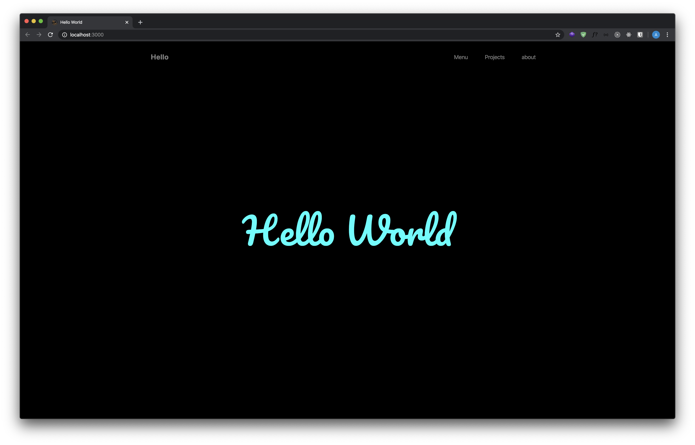

# StarterHTML! 🌑🦇

HTML CSS SCSS FONTAWESOME & BOOTSTRAP STARTER


## Usage

#### First run command  
```sh
 $ yarn; yarn start
 ``` 
Will automatically open your browser and refresh to each change! ⭐️

<br>

#### Run command for opening your project
```sh
 $ yarn start
 ```

<br>

#### CSS
Only modify SCSS files, not CSS! 

<br><hr><br>

&copy; 2019 [Alexia Lechot / KRAKENWAVE](https://krakenwave.ch)
